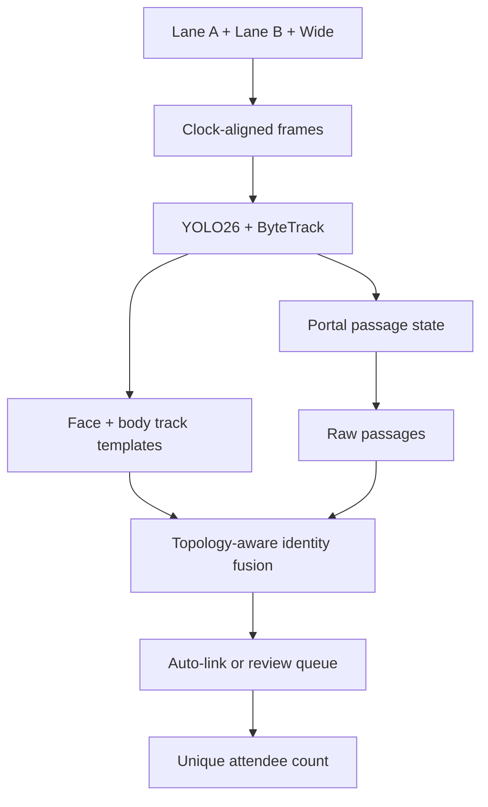

# Ingress Event Intelligence v4

An event-scale passage counter and deduplication system for two flowing entry lanes under one tent. It records every physical passage first, then resolves repeat attendees across Lane A, Lane B, and a shared wide camera using temporal, topology, face-template, and body-template evidence.

The old frame-level matcher is preserved at the repository root for reference. v4 is the new default system.

## What is working

- **One passage, one event:** a hysteretic portal state machine emits a passage only after a stable directional line crossing.
- **Track-level evidence:** face and body embeddings are aggregated across the best frames in a tracklet instead of trusting one frame.
- **Explainable identity fusion:** a calibrated logistic layer combines face, body, quality, time, topology, candidate margin, and hard impossible-overlap constraints.
- **Human-in-the-loop review:** ambiguous links enter a small reversible disagreement queue; decisions are recorded in an event-scoped audit trail.
- **Event Rehearsal Lab:** synchronized playback, model-run comparison, ground-truth error, false merges/splits, passage recall, review load, camera health, and model divergence.
- **YOLO26 adapter:** Ultralytics YOLO26 + ByteTrack support is available through the `vision` extra. InsightFace receives OpenCV BGR frames correctly.
- **Temporary-by-construction storage:** every record and file is scoped to an event. Purge uses an exact confirmation, SQLite secure-delete, WAL truncation, vacuuming, and a bounded event directory.
- **Deterministic operation:** video manifests include SHA-256 hashes so the same three source files and model bundle produce a comparable rehearsal run.

## Start it

From the repository root:

```bash
./start_all.sh
```

That creates the local Python environment, builds the command center, seeds a deterministic rehearsal, and serves the app and API from one process.

For the optional real vision stack:

```bash
./start_all.sh --vision
```

Useful developer commands:

```bash
cd v4
.venv/bin/pytest
.venv/bin/ruff check backend tests
cd web && npm run build && npm run test:sites
```

## Turn last year's video into the advantage

1. Put the three synchronized recordings somewhere outside the repository.
2. Create an immutable replay manifest:

   ```bash
   cd v4
   .venv/bin/ingress manifest \
     --event harvest-2025 \
     --camera lane-a=/recordings/lane-a.mp4 \
     --camera lane-b=/recordings/lane-b.mp4 \
     --camera wide=/recordings/wide.mp4 \
     --output data/events/harvest-2025/manifest.json
   ```

3. Replay the recordings to generate tracklets and a disagreement queue. Review ambiguous pairs in the command center instead of labeling every frame.
4. Export reviewed pairs as CSV and fit the event-domain fusion layer:

   ```bash
   .venv/bin/ingress train-fusion \
     --labels data/events/harvest-2025/reviewed-pairs.csv \
     --output data/events/harvest-2025/fusion-model.json
   ```

5. Compare the candidate run against a held-out time block. Ship only when unique-count error, false merges, false splits, passage recall, and review minutes all pass the event gate.

Do not fine-tune on random frames from the same track and test on adjacent frames; that leaks identity and lighting. Split by time block or entire tracklet. The fusion trainer applies a five-times penalty to false merges because collapsing two people is the most damaging error for a unique-attendee count.

## Runtime architecture



Raw passages are never hidden by deduplication. The operational count is reproducible from passages plus identity-link decisions.

## API surface

| Endpoint | Purpose |
|---|---|
| `GET /api/events/{id}/summary` | Event count, progress, camera state, active run |
| `GET /api/events/{id}/timeline` | Passage, health, and model-divergence samples |
| `GET /api/events/{id}/replay-runs` | Comparable model bundles and error metrics |
| `POST /api/events/{id}/replay/control` | Play, pause, seek, and replay speed |
| `GET /api/events/{id}/candidates` | Ambiguous identity links |
| `POST /api/events/{id}/candidates/{candidate}/decision` | Reversible operator judgment |
| `PUT /api/events/{id}/cameras/{camera}/calibration` | Normalized approach zone and commit line |
| `GET /api/events/{id}/purge-plan` | Exact records, directory, bytes, and confirmation phrase |
| `POST /api/events/{id}/purge` | Secure event-scoped deletion |
| `WS /api/events/{id}/stream` | Live summary stream |

Interactive OpenAPI documentation is served at `/api/docs`.

## Storage contract

The event ID is the isolation boundary. Database foreign keys cascade from `events`; recordings and derived artifacts live only under `data/events/<event-id>`. A purge rejects unbounded paths, removes the event directory, deletes all event rows including the temporary audit trail, enables SQLite `secure_delete`, truncates the WAL, and vacuums free pages.

The command center exposes the plan before deletion and requires the exact phrase `PURGE <event-id>`.

## Honest limits

The included fixture demonstrates the product and API contract; its displayed accuracy is not a claim about a new event. Real accuracy must be measured on the provided historical video after camera clocks and portal geometry are calibrated. Face evidence should remain one signal in the fusion model—occlusion, lighting, pose, and crowd density make a single biometric threshold brittle.
